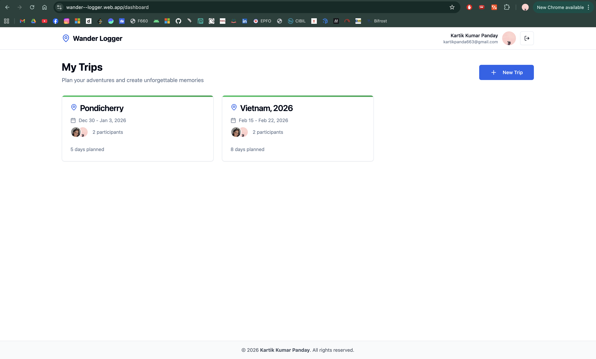
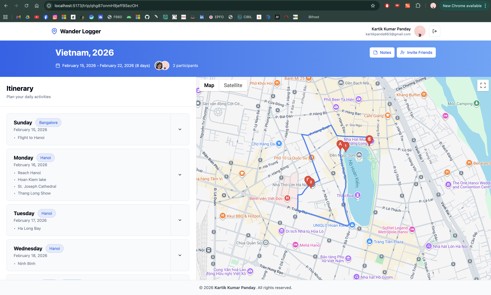
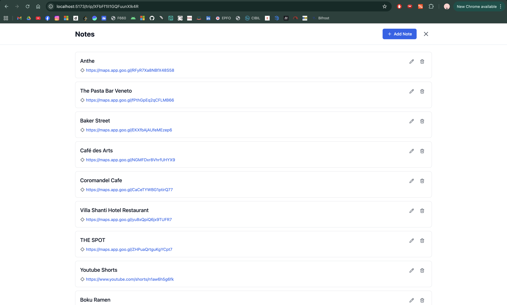

# Wander Logger 🗺️

A collaborative trip planning application inspired by Wanderlog. Plan your perfect journey with friends, create detailed itineraries, and visualize your adventures on an interactive map.

## 📚 Documentation

**Comprehensive guides available in the [`/docs`](./docs) folder:**

- 🚀 **[Setup Guide](./docs/SETUP.md)** - Complete development setup instructions
- 🚀 **[Quick Deploy Guide](./docs/QUICK_DEPLOY.md)** - Get your app live in 3 steps
- 🔥 **[Firebase Setup Guide](./docs/FIREBASE_SETUP.md)** - Complete Firebase configuration
- 📦 **[Full Deployment Guide](./docs/DEPLOYMENT_GUIDE.md)** - Detailed deployment instructions
- 👥 **[Guest Mode Guide](./docs/GUEST_MODE.md)** - Local storage guest functionality

## 📸 Screenshots

### Dashboard

*View all your trips with participant avatars, dates, and duration*

### Trip Planning & Map

*Plan day-by-day activities with interactive map visualization showing routes and markers*

### Notes & Links

*Save important links, restaurant recommendations, and travel resources*

## ✨ Features

### Core Trip Planning
- **📅 Trip Management** - Create and organize multiple trips with date ranges
- **🗓️ Day-by-Day Itinerary** - Plan activities for each day of your trip with expandable day cards
- **🏙️ City Tags** - Assign cities/locations to each day for better organization
- **📍 Location Integration** - Add locations with latitude/longitude coordinates
- **🕒 Time Scheduling** - Set specific times or all-day events for activities
- **🏷️ Activity Tags** - Organize activities with custom tags
- **📝 Rich Notes System** - Add notes with support for:
  - Google Maps links for places and restaurants
  - YouTube links for travel inspiration
  - External URLs and references
  - Edit and delete capabilities

### Visualization & Maps
- **🗺️ Interactive Maps** - Real-time visualization of your trip route
  - Activity markers showing all planned locations
  - Automatic route drawing between activities
  - Toggle between Map and Satellite views
  - Full-screen map mode
  - Integrated with Google Maps for accurate navigation

### Collaboration & Sharing
- **👥 Real-time Collaboration** - Invite friends and collaborate on trip planning
- **📧 Email Invitations** - Send trip invitations via "Invite Friends" button
- **⚡ Live Sync** - Real-time updates across all collaborators using Firestore
- **👤 Participant Avatars** - Visual display of trip participants with profile pictures
- **👥 Participant Management** - View all collaborators on trip cards and trip pages

### Dashboard & UI
- **🎨 Beautiful Trip Cards** - Visual trip cards featuring:
  - Trip title with location icon
  - Date ranges with calendar icon
  - Participant avatars
  - Duration summary (e.g., "5 days planned")
  - Modern card-based layout
- **📱 Responsive Design** - Works seamlessly on desktop and mobile devices
- **🎯 Trip Banner** - Comprehensive trip header showing dates, duration, and participants

### Authentication & Access
- **🔐 Google Authentication** - Secure login with Firebase Auth
- **👻 Guest Mode** - Plan trips without signing in using local storage
- **🔄 Offline Support** - Guest trips work without internet connection

### System Features
- **📊 Day Reviews** - Rate and review each day of your trip
- **⚙️ Smart Configuration** - Environment validation with helpful setup prompts
- **🔄 Auto-save** - All changes saved automatically to Firestore

## 🎯 Usage Guide

### Creating a Trip

1. **Sign in** with your Google account (or use Guest Mode)
2. Click the **"+ New Trip"** button on the dashboard
3. Enter trip details:
   - Trip title (e.g., "Vietnam, 2026" or "Pondicherry")
   - Start date
   - End date
4. Click **"Create Trip"**
5. Your new trip card will appear on the dashboard

### Planning Your Itinerary

1. **Open a trip** from your dashboard by clicking on the trip card
2. **View the trip banner** showing full trip details, dates, and participants
3. **Expand a day** by clicking on any day card in the itinerary panel
4. **Add city/location** to each day using the city tag feature
5. Click **"Add Activity"** to create activities:
   - Title (required) - e.g., "Hoan Kiem lake", "Flight to Hanoi"
   - Time (optional) - set specific times or mark as all-day
   - Description
   - Latitude/Longitude (for map display)
6. Click **"Add Activity"** to save

### Adding Trip Notes

1. Click the **"Notes"** button in the trip header
2. Click **"+ Add Note"** to create a new note
3. Add useful information like:
   - Restaurant recommendations (e.g., "The Pasta Bar Veneto", "Baker Street")
   - Google Maps links to places
   - YouTube videos for inspiration
   - Hotel information (e.g., "Villa Shanti Hotel Restaurant")
   - Any other useful URLs or text
4. Edit or delete notes using the icons next to each note

### Viewing on the Interactive Map

1. Activities with coordinates automatically appear as markers on the map
2. The route between activities is drawn automatically with blue lines
3. Toggle between **Map** and **Satellite** views
4. Click the fullscreen icon to expand the map
5. Map updates in real-time as you add or modify activities

### Inviting Collaborators

> **Note**: Invitation system requires Firebase Functions for email sending (optional feature)

1. Open a trip
2. Click the **"Invite Friends"** button in the trip header
3. Enter collaborator's email address
4. They'll receive an invitation link
5. Once accepted, they can:
   - View and edit the trip
   - Add activities and notes
   - See real-time updates
6. Collaborator avatars appear on the trip card and trip page

## 🤝 Contributing

Contributions are welcome! Please feel free to submit a Pull Request.

## 📄 License

This project is open source and available under the MIT License.

## 👨‍💻 Author

Built with ❤️ by **Kartik Kumar Panday**

## 📝 Copyright

© 2026 Kartik Kumar Panday. All rights reserved.

---

**Happy Travel Planning! ✈️🌍**
